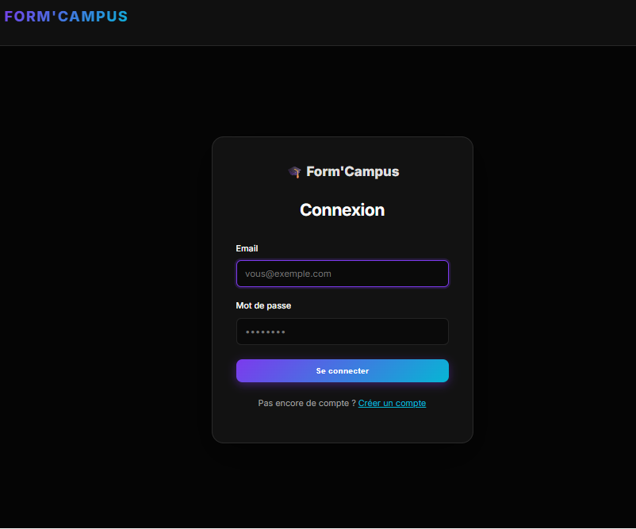
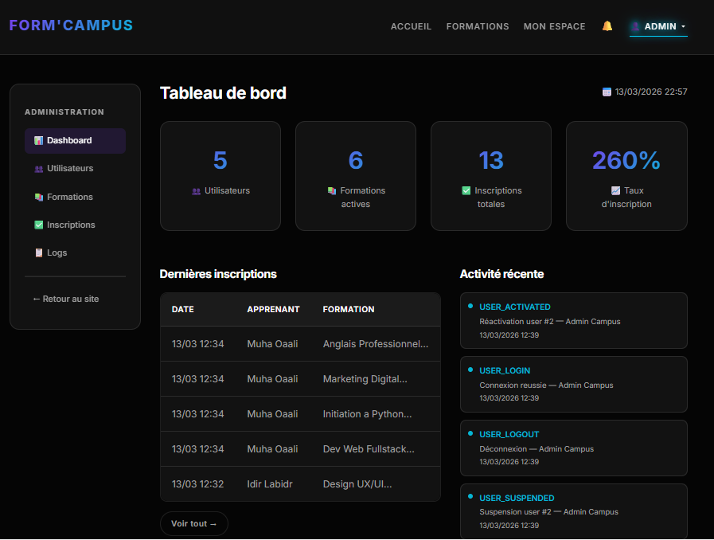

# FormCampus Learning Platform

Plateforme web de gestion de formations en ligne.

## Technologies
- PHP
- MySQL
- HTML
- CSS
- JavaScript

## Fonctionnalités
- Gestion des formations
- Inscription des utilisateurs
- Tableau de bord administrateur
- Notifications
- Évaluation des formations

## Installation

1. Cloner le projet
2. Importer la base de données (sql/)
3. Configurer includes/db.php
4. Lancer avec XAMPP

## 📁 Structure des fichiers

```
formcampus/
├── index.php                  ← Page d'accueil (carrousel 3D)
├── formations.php             ← Catalogue avec filtres
├── detail.php                 ← Détail d'une formation
├── login.php                  ← Connexion USER + ADMIN
├── register.php               ← Inscription compte
├── logout.php
├── inscription_publique.php   ← Formulaire public
├── my_learning.php            ← Espace apprenant
├── update_progression.php     ← Mise à jour progression
├── profile.php                ← Profil + changement mdp
├── notifications.php          ← Notifications
│
├── admin_dashboard.php        ← Tableau de bord admin
├── admin_users.php            ← Gestion utilisateurs
├── admin_formations.php       ← Liste formations (CRUD)
├── admin_formation_edit.php   ← Ajouter / modifier formation
├── admin_inscriptions.php     ← Suivi inscriptions + export
├── admin_logs.php             ← Logs d'activité
├── admin_export.php           ← Export CSV & PDF
│
├── includes/
│   ├── db.php                 ← Connexion PDO + helpers
│   ├── auth.php               ← Fonctions auth (require_login, etc.)
│   ├── header.php             ← Entête + nav responsive
│   ├── footer.php             ← Pied de page
│   └── admin_sidebar.php      ← Sidebar admin
│
├── css/style.css              ← Design complet
├── js/script.js               ← JS (carousel, toasts, filtres...)
├── uploads/                   ← Images formations + avatars
└── sql/database.sql           ← Schéma + données de test
```

---

## ✨ Fonctionnalités

### Interface Utilisateur
- ✅ Page d'accueil avec carrousel 3D (design original conservé)
- ✅ Catalogue avec filtres (catégorie + recherche)
- ✅ Page détail formation avec bouton S'inscrire
- ✅ Mon Espace Apprenant (formations en cours + progression)
- ✅ Mise à jour de la progression (slider)
- ✅ Profil (nom, email, avatar, mot de passe)
- ✅ Notifications internes (badge + page dédiée)
- ✅ Inscription publique (sans compte pré-requis)

### Interface Administration
- ✅ Dashboard avec statistiques clés
- ✅ Gestion utilisateurs (actif/suspendu/supprimé)
- ✅ CRUD formations (ajouter, modifier, supprimer)
- ✅ Suivi des inscriptions avec progression
- ✅ Export CSV et PDF des inscrits
- ✅ Logs d'activité (200 dernières actions)

### Technique
- ✅ Authentification par session PHP
- ✅ Rôles USER / ADMIN avec middleware
- ✅ Skeletons de chargement
- ✅ Toast notifications (succès / erreur)
- ✅ Recherche live dans les tableaux admin
- ✅ Responsive mobile (hamburger menu)
- ✅ Design original conservé (carrousel 3D, glassmorphism)


## Screenshots

### Login Page


### Admin Dashboard


### Formations

---


